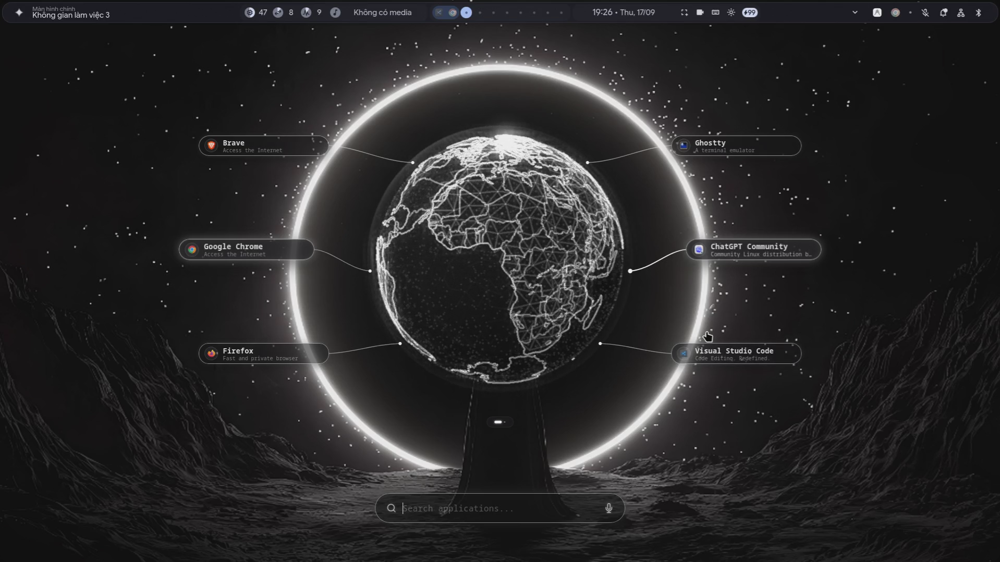
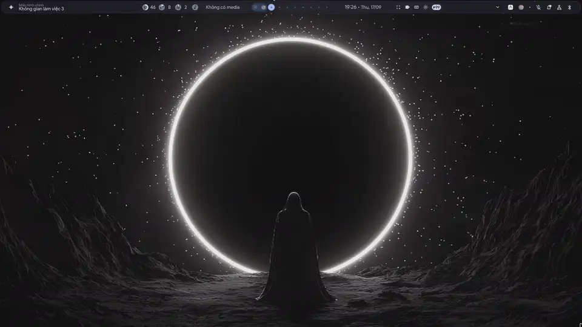

<div align="center">

# 🌐 Holographic Sphere Launcher

### *"Quả Cầu Launcher"*

**A native, futuristic 3D holographic application launcher for Wayland desktops (Hyprland, Sway, River, Wayfire, and more).**

[](LICENSE)
[](#features)
[](#features)
[](#requirements)
[](https://github.com/conlongnhong/sphere-launcher/releases)
[](https://github.com/conlongnhong/sphere-launcher/actions)

[English](README.md) • [Tiếng Việt](README.vi.md)

<br/>



</div>

---

## 🎬 Live Demo & Video Showcase

<div align="center">



<p>
  🎥 <b>Full 1080p 60fps Recording</b>: 
  <a href="https://github.com/conlongnhong/sphere-launcher/releases/download/v1.0.0/recording_2026-09-17_19.26.25.mp4"><b>Download / Watch recording_2026-09-17_19.26.25.mp4 (49MB)</b></a> 
  • <a href="assets/demo.mp4">Local MP4 Clip (3MB)</a>
</p>

</div>

---

## ✨ Features

- **Futuristic 3D Holographic Globe**: Rendered in WebGL via Three.js with landmass polygons, dual-hemisphere coastlines and international borders, triangulated mesh relief, energetic particle hotspots, and multi-pass white bloom.
- **Wayland Native & Zero Lag**: Uses `gtk-layer-shell` to render as a composited top overlay over your desktop. Your wallpaper and windows remain visible through the transparent backdrop.
- **Interactive Orbit**: Click and drag the globe with your mouse to rotate the Earth in 3D. Scroll the mouse wheel to dynamically scale rotation speed from `0.5x` to `2.5x`.
- **Dynamic Satellite Cards**: Six floating launcher cards anchored to 3D hotspot coordinates via animated Bézier curve traces with moving photons.
- **Instant Fuzzy Search**: Type to instantly search installed desktop applications (`.desktop` files) by name, executable, keywords, or generic category.
- **Warm IPC Daemon**: Instantaneous hotkey toggling via a lightweight Unix socket daemon (`/tmp/sphere_launcher.sock`).
- **Offline & Self-Contained**: Three.js, map boundary topologies (`land.json`, `countries-110m.json`), and shaders are packaged locally. No network access required at runtime.
- **Graceful Fallback**: Automatically falls back to an undecorated fullscreen window if the compositor lacks `wlr-layer-shell`.

---

## 📦 Requirements

The host requires Python 3, PyGObject, GTK 3, GtkLayerShell, and WebKit2GTK:

| Distribution | Installation Command |
| :--- | :--- |
| **Arch Linux / Manjaro** | `sudo pacman -S --needed gtk3 gtk-layer-shell webkit2gtk-4.1 python-gobject` |
| **Fedora** | `sudo dnf install -y gtk3 gtk-layer-shell webkit2gtk4.1 python3-gobject` |
| **Ubuntu / Debian / Mint** | `sudo apt update && sudo apt install -y python3-gi gir1.2-gtk-3.0 gir1.2-gtklayershell-0.1 gir1.2-webkit2-4.1` |
| **openSUSE** | `sudo zypper in -y gtk3 gtk-layer-shell typelib-1_0-WebKit2-4_1 python3-gobject` |
| **Void Linux** | `sudo xbps-install -S python3-gobject gtk+3 gtk-layer-shell webkit2gtk` |

---

## 🚀 Quick Start & Installation

### Option 1: One-Line Installer (Recommended)

```bash
curl -fsSL https://raw.githubusercontent.com/conlongnhong/sphere-launcher/main/install.sh | bash
```

### Option 2: Clone and Install

```bash
git clone https://github.com/conlongnhong/sphere-launcher.git
cd sphere-launcher
./install.sh
```

The installer automatically:
1. Detects your distribution and verifies/installs system dependencies.
2. Copies files to `~/.local/share/sphere-launcher/`.
3. Installs executable commands `sphere-launcher` and `sphere-toggle` into `~/.local/bin/`.
4. Installs the desktop entry into `~/.local/share/applications/sphere-launcher.desktop`.

### Option 3: Arch Linux (PKGBUILD)

```bash
git clone https://github.com/conlongnhong/sphere-launcher.git
cd sphere-launcher/packaging/arch
makepkg -si
```

---

## ⌨️ Hotkey Configuration

Bind `sphere-toggle` to your preferred keyboard shortcut in your Wayland compositor configuration.

### Hyprland (`~/.config/hypr/hyprland.conf`)

```ini
# Toggle launcher with Super + Space
bind = SUPER, SPACE, exec, sphere-toggle

# Or toggle with Super key alone
bindr = SUPER, SUPER_L, exec, sphere-toggle
```

### Sway (`~/.config/sway/config`)

```ini
bindsym $mod+space exec sphere-toggle
```

### River (`~/.config/river/init`)

```bash
riverctl map normal Super Space spawn sphere-toggle
```

### Wayfire (`~/.config/wayfire.ini`)

```ini
[command]
binding_launcher = <super> KEY_SPACE
command_launcher = sphere-toggle
```

---

## 🎮 Controls & Interaction

| Input | Action |
| :--- | :--- |
| **Typing** | Live search through installed applications |
| `↓` / `Tab` | Reveal applications when search box is empty / Navigate down |
| `↑` / `Shift+Tab` | Navigate up |
| `←` / `→` | Switch between left and right card columns |
| `Enter` / **Click** | Launch selected application and close launcher |
| `Esc` / **Click Background** | Dismiss / hide launcher |
| **Click & Drag Globe** | Rotate the 3D hologram Earth |
| **Mouse Scroll on Globe** | Adjust rotation speed (`0.5x` – `2.5x`) |

---

## 🛠️ CLI Commands

```bash
sphere-launcher            # Start launcher daemon or show if running
sphere-launcher --toggle   # Toggle visibility (or use 'sphere-toggle')
sphere-launcher --show     # Show launcher window
sphere-launcher --hide     # Hide launcher window
sphere-launcher --quit     # Terminate background daemon
sphere-launcher --version  # Print version
sphere-launcher --help     # Show help information
```

---

## 💖 Support / Donate

If you enjoy **Holographic Sphere Launcher** and want to support the project, consider buying me a coffee! Your support keeps this project alive and continuously evolving.

<div align="center">


<p>
  <b>MoMo / VietQR / Napas 247</b><br/>
  <b>NGUYỄN NAM DƯƠNG</b><br/>
  <code>STK: *******220</code>
</p>

*Thank you so much for your generosity and support! 🙏*

</div>

---

## 🧪 Testing

Run the automated test suite verifying geographic projections, polygon holes, date line wrapping, and viewport scaling:

```bash
node --test sphere_launcher/tests/geometry.test.cjs
node --check sphere_launcher/web/globe.js
node --check sphere_launcher/web/app.js
python3 -m py_compile sphere_launcher/main.py
```

---

## 🗑️ Uninstallation

Run the uninstaller to cleanly remove all files:

```bash
curl -fsSL https://raw.githubusercontent.com/conlongnhong/sphere-launcher/main/uninstall.sh | bash
```

Or from the cloned repository:
```bash
./uninstall.sh
```

---

## 📄 License

This project is open-source under the [MIT License](LICENSE).
